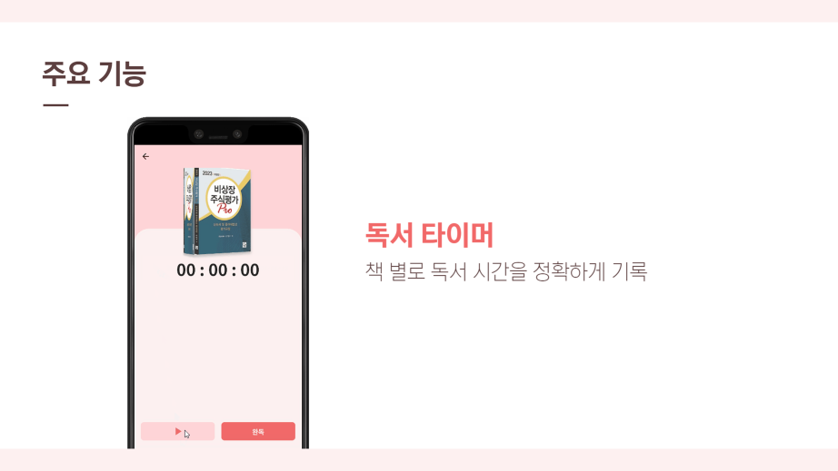
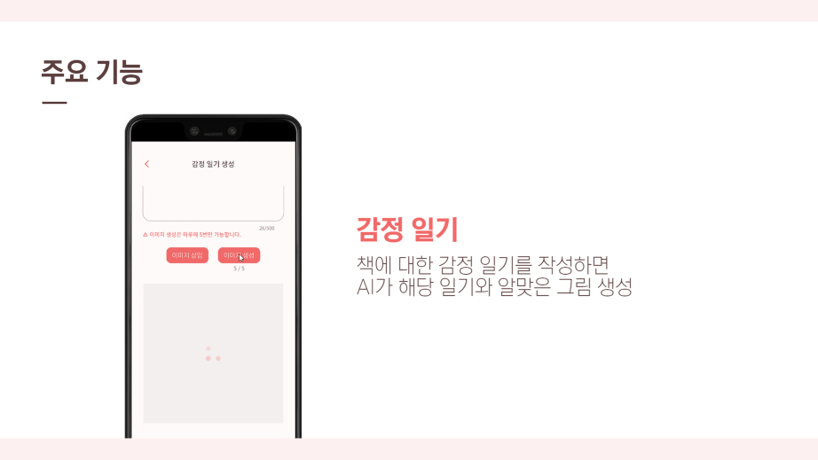
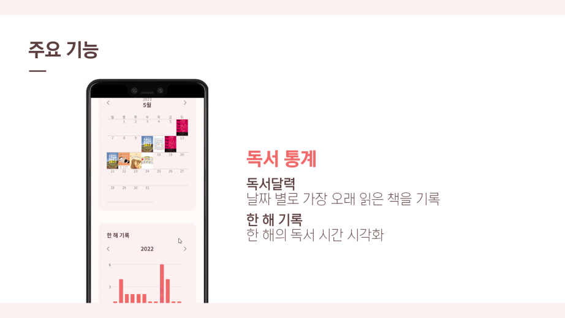
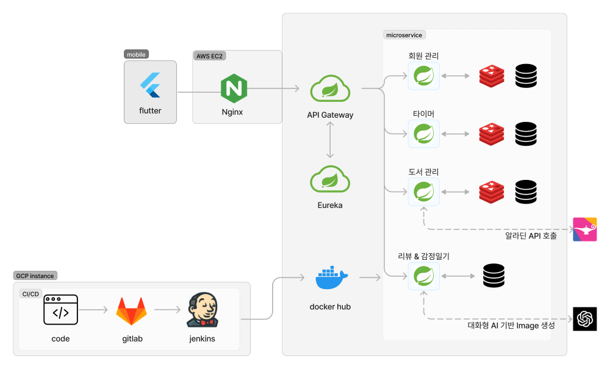
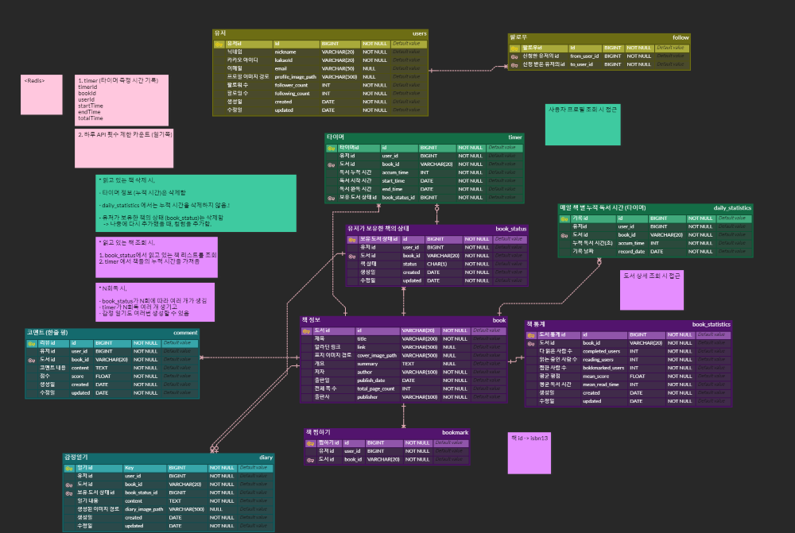

 

    <h3></h3>
    <h3> 독서기록을 바탕으로 나만의 AI 이미지 기록을 할 수 있는 독서기록앱 </h3>
    

 

- LINK: https://m.onestore.co.kr/mobilepoc/apps/appsDetail.omp?prodId=0000769537 (원스토어)
- 기간: 2023.04.10 ~ 2023.05.20 (6주, 5인)

## 목차

[1. 프로젝트 소개](#1-프로젝트-소개)

[2. 기술 스택](#2-기술-스택)

[3. 주요 기능](#3-주요기능)

[4. 화면 상세](#-화면-상세)

[5. 아키텍처](#5-아키텍처)

[6. 프로젝트 설계 문서](#6-프로젝트-설계-문서)

## 1. 프로젝트 소개
- 독서 습관이 없는 사람들을 위해 동기를 부여해주고 독서에 몰입할 수 있는 환경을 제공하는 독서 기록앱
 

## 2. 기술 스택

|      Part      |                            Tech ⚙                            |
| :------------: | :----------------------------------------------------------: |
|   **FE**    |  |
|    **BE**    | 
| **Infra** |  |

## 3. 주요 기능

## 4. 화면 상세

## 5 아키텍처

## 6. 프로젝트 설계 문서
- ERD

